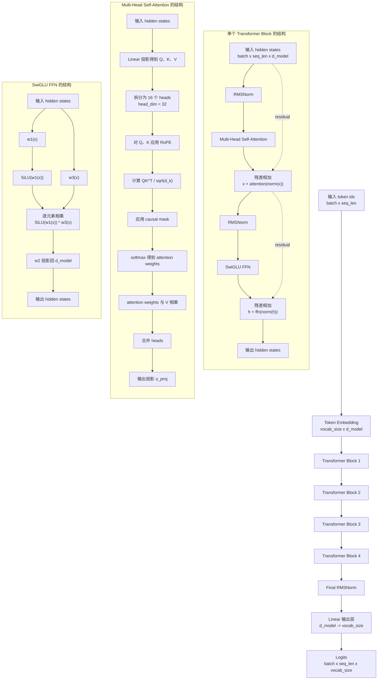

# CS336 Assignment 1 实现与实验记录

本仓库是 Stanford CS336 Spring 2026 Assignment 1: Basics 的个人实现。

作业说明见原始 PDF：

```text
cs336_assignment1_basics.pdf
```

当前测试结果：

```bash
uv run pytest -q
```

结果为：

```text
46 passed, 2 skipped
```

两个 skipped 用例是 tokenizer 内存限制相关测试，在非 Linux 系统上会被跳过。

## 1. 实验结论

本项目已经完成 Assignment 1 Basics 的核心实现和实验记录。所有单元测试通过，主模型可以完成 TinyStories 训练、验证、checkpoint 保存、文本生成和 wandb 记录。

本节按照作业 PDF 第 7.2 和第 7.3 的实验提问组织结论。

| 作业问题 | 实验设置 | 回答 |
|---|---|---|
| TinyStories baseline 训练效果如何？ | baseline 使用 `batch_size=64`、`context_length=512`、`num_steps=10000`、`d_model=512`、`num_layers=4`、`num_heads=16`、`d_ff=1344`。 | baseline 可以稳定训练到 step 9999，best valid loss 为 1.4668，final train loss 为 1.4789。这个结果作为后续结构消融和 batch size 对比的参照。 |
| 移除 RMSNorm 后，在原来的较优学习率下会发生什么？能否通过更低学习率恢复稳定？ | `no_rmsnorm` 移除所有 RMSNorm，其余配置保持 baseline，学习率仍为 `max_lr=3e-4`、`min_lr=3e-5`。 | 本次设置下训练没有发散，但验证集效果变差，best valid loss 从 baseline 的 1.4668 变为 1.4919。说明 RMSNorm 对当前模型的泛化和训练稳定性有帮助。本次没有额外保留更低学习率的完整对照曲线，因此不能严谨声称更低学习率是否会进一步改善。 |
| Post-Norm 相比 Pre-Norm 会发生什么？ | `post_norm` 把 Transformer block 从 pre-norm 改成 post-norm，其余配置保持 baseline。 | post-norm 可以完成训练，但 best valid loss 为 1.4779，略差于 pre-norm baseline 的 1.4668。说明在当前小模型和 TinyStories 设置下，pre-norm 更稳。 |
| 不使用位置编码的 NoPE 相比 RoPE 表现如何？ | `nope` 移除 RoPE，不给模型显式位置编码，其余配置保持 baseline。 | NoPE 退化最明显，best valid loss 为 1.6008，final train loss 为 1.6254。说明 RoPE 对当前 decoder-only Transformer 的语言建模效果很重要。 |
| SwiGLU 和参数量近似匹配的 SiLU FFN 相比如何？ | `silu_ffn` 使用 `FFN_SiLU(x)=W2 SiLU(W1 x)`，并设置 `d_ff=2048=4*d_model`，用于近似匹配 SwiGLU 参数量。 | SiLU FFN 的 best valid loss 为 1.5000，差于 SwiGLU baseline 的 1.4668。说明当前实验中 SwiGLU 的门控结构有效。 |
| batch size 变化会如何影响训练？ | `bs_16`、`bs_32` 和 baseline `bs_64` 保持总 token 数约为 327,680,000；`bs_128` 尝试运行但显存不足。 | `bs_16` 的 best valid loss 为 1.4733，`bs_32` 为 1.4692，`bs_64` baseline 为 1.4668。三者接近，说明在总 token 数相同的设置下，batch size 对最终 loss 有影响，但小于 RoPE、RMSNorm、SwiGLU 这类结构改动。`bs_128` 因显存不足 OOM，未形成有效结果。 |
| 生成文本的流畅度如何？哪些因素会影响生成质量？ | 使用 baseline checkpoint，分别生成 greedy、temperature 0.7/top-p 0.9、temperature 1.0/top-p 0.9、temperature 1.2/top-p 0.95 的文本。 | baseline 已能生成接近 TinyStories 风格的短故事文本。生成质量主要受模型验证 loss、训练 token 数、temperature、top-p 和 prompt 影响。temperature 较低时输出更保守，temperature 较高时输出更多样但更容易出现不稳定内容。 |

主要结果表如下：

| 实验 | final step | best valid loss | final train loss |
|---|---:|---:|---:|
| baseline | 9999 | 1.4668 | 1.4789 |
| no_rmsnorm | 9999 | 1.4919 | 1.4766 |
| post_norm | 9999 | 1.4779 | 1.4764 |
| nope | 9999 | 1.6008 | 1.6254 |
| silu_ffn | 9999 | 1.5000 | 1.5365 |
| bs_16 | 39999 | 1.4733 | 1.4783 |
| bs_32 | 19999 | 1.4692 | 1.4517 |
| bs_64 | 9999 | 1.4668 | 1.4789 |

`bs_64` 与 baseline 是同一个配置，因此不重复训练。

## 2. 环境与运行方式

本项目使用 `uv` 管理 Python 环境。常用命令如下：

| 任务 | 命令 |
|---|---|
| 安装并同步依赖 | `uv sync` |
| 运行全部测试 | `uv run pytest -q` |
| 训练 BPE 分词器 | `uv run python -u -m cs336_basics.train_bpe` |
| 编码 TinyStories 数据集 | `uv run python -u -m cs336_basics.tokenizer` |
| 运行主训练脚本 | `uv run python -u -m cs336_basics.train` |
| 查看实验列表 | `uv run python -m experiment.run_training_experiment --list` |
| 生成文本 | `uv run python -u -m experiment.generate_samples --checkpoint checkpoints/latest.pt` |
| 生成学习率曲线 | `uv run python -u -m experiment.plot_lr_curve` |

在 AutoDL 等服务器上运行时，建议使用 `python -u`，这样终端可以实时打印训练进度。

## 3. 数据集下载

作业要求使用 TinyStories 和 OpenWebText sample。数据默认放在 `data/` 目录下。

### 3.1 官方 Hugging Face 下载命令

```bash
mkdir -p data
cd data

wget -c https://huggingface.co/datasets/roneneldan/TinyStories/resolve/main/TinyStoriesV2-GPT4-train.txt
wget -c https://huggingface.co/datasets/roneneldan/TinyStories/resolve/main/TinyStoriesV2-GPT4-valid.txt

wget -c https://huggingface.co/datasets/stanford-cs336/owt-sample/resolve/main/owt_train.txt.gz
gunzip owt_train.txt.gz
wget -c https://huggingface.co/datasets/stanford-cs336/owt-sample/resolve/main/owt_valid.txt.gz
gunzip owt_valid.txt.gz

cd ..
```

### 3.2 国内镜像下载命令

如果 Hugging Face 连接慢，可以使用 `hf-mirror.com`：

```bash
mkdir -p data
cd data

wget -c https://hf-mirror.com/datasets/roneneldan/TinyStories/resolve/main/TinyStoriesV2-GPT4-train.txt
wget -c https://hf-mirror.com/datasets/roneneldan/TinyStories/resolve/main/TinyStoriesV2-GPT4-valid.txt

wget -c https://hf-mirror.com/datasets/stanford-cs336/owt-sample/resolve/main/owt_train.txt.gz
gunzip owt_train.txt.gz
wget -c https://hf-mirror.com/datasets/stanford-cs336/owt-sample/resolve/main/owt_valid.txt.gz
gunzip owt_valid.txt.gz

cd ..
```

下载完成后，可以用下面的命令检查文件是否存在：

```bash
ls -lh data/TinyStoriesV2-GPT4-train.txt data/TinyStoriesV2-GPT4-valid.txt
```

## 4. 已完成模块

| 模块 | 文件 | 功能说明 | 状态 |
|---|---|---|---|
| BPE 训练 | `cs336_basics/train_bpe.py` | 从文本语料训练 byte-level BPE，支持 special tokens 和并行预分词 | ✅ |
| BPE Tokenizer | `cs336_basics/tokenizer.py` | 加载 vocab/merges，支持 encode、decode、encode_iterable 和数据集编码 | ✅ |
| Linear | `cs336_basics/linear.py` | 实现无 bias 线性层和参数初始化 | ✅ |
| Embedding | `cs336_basics/embedding.py` | 实现 token embedding 查表 | ✅ |
| RMSNorm | `cs336_basics/rmsnorm.py` | 实现 RMSNorm 归一化层 | ✅ |
| SwiGLU | `cs336_basics/swiglu.py` | 实现 SiLU 激活和 SwiGLU 前馈网络 | ✅ |
| RoPE | `cs336_basics/rope.py` | 实现 Rotary Position Embedding | ✅ |
| Softmax | `cs336_basics/softmax.py` | 实现数值稳定 softmax | ✅ |
| Scaled Dot-Product Attention | `cs336_basics/scaled_dot_product_attention.py` | 实现带 causal mask 的注意力计算 | ✅ |
| Multi-Head Self-Attention | `cs336_basics/multihead_self_attention.py` | 实现 Q/K/V 投影、多头拆分、RoPE 和输出投影 | ✅ |
| Transformer Block | `cs336_basics/transformer.py` | 实现 pre-norm Transformer block | ✅ |
| Transformer LM | `cs336_basics/transformer.py` | 实现 token embedding、多个 block、最终 RMSNorm 和 vocab 输出层 | ✅ |
| Cross Entropy | `cs336_basics/cross_entropy.py` | 实现 log-sum-exp 形式的交叉熵损失 | ✅ |
| AdamW | `cs336_basics/adamw.py` | 实现 AdamW 优化器 | ✅ |
| 学习率调度 | `cs336_basics/learning_rate_schedule.py` | 实现 warmup + cosine decay 学习率 | ✅ |
| 梯度裁剪 | `cs336_basics/gradient_clipping.py` | 实现全局 L2 norm 梯度裁剪 | ✅ |
| 数据加载 | `cs336_basics/data_loading.py` | 从 token 数组中随机采样 batch | ✅ |
| Checkpoint | `cs336_basics/checkpoint.py` | 保存和恢复模型、优化器、训练步数 | ✅ |
| 主训练脚本 | `cs336_basics/train.py` | 支持训练、验证、wandb 记录、checkpoint 保存和恢复 | ✅ |
| 解码生成 | `cs336_basics/decoder.py` | 支持 temperature 和 top-p 采样生成文本 | ✅ |
| 消融实验 | `experiment/ablation_train.py` | 独立实现消融实验专用 Transformer，不改动作业主模型 | ✅ |
| 实验调度 | `experiment/run_training_experiment.py` | 根据实验名加载配置并启动训练 | ✅ |
| 学习率曲线导出 | `experiment/plot_lr_curve.py` | 导出 `lr_curve.csv` 和 `lr_curve.png` | ✅ |
| 生成文本导出 | `experiment/generate_samples.py` | 用 checkpoint 生成多组采样文本 | ✅ |

## 5. 训练配置

主配置位于：

```text
cs336_basics/config.py
```

当前默认配置如下：

| 配置项 | 当前值 | 说明 |
|---|---:|---|
| `train_data_path` | `data/tinystories_train_tokens.npy` | 训练 token 文件 |
| `valid_data_path` | `data/tinystories_valid_tokens.npy` | 验证 token 文件 |
| `checkpoint_dir` | `checkpoints` | checkpoint 保存目录 |
| `latest_checkpoint_path` | `checkpoints/latest.pt` | 最新 checkpoint 路径 |
| `resume_path` | `None` | 默认不恢复训练 |
| `vocab_size` | `10000` | BPE 词表大小 |
| `context_length` | `512` | 每条样本的上下文长度 |
| `d_model` | `512` | Transformer 隐藏维度 |
| `num_layers` | `4` | Transformer block 数量 |
| `num_heads` | `16` | 注意力头数 |
| `head_dim` | `32` | 每个头的维度，等于 `512 / 16` |
| `d_ff` | `1344` | SwiGLU 中间层维度，约等于 `8/3 * d_model` |
| `rope_theta` | `10000.0` | RoPE 频率参数 |
| `batch_size` | `64` | 默认训练 batch size |
| `num_steps` | `10000` | 默认训练步数 |
| `max_lr` | `3e-4` | 最大学习率 |
| `min_lr` | `3e-5` | 最小学习率 |
| `warmup_iters` | `1000` | warmup 步数 |
| `cosine_cycle_iters` | `10000` | cosine decay 总步数 |
| `weight_decay` | `0.1` | AdamW 权重衰减 |
| `betas` | `(0.9, 0.999)` | AdamW 一阶和二阶动量系数 |
| `eps` | `1e-8` | AdamW 数值稳定项 |
| `max_l2_norm` | `1.0` | 梯度裁剪阈值 |
| `eval_interval` | `500` | 每 500 step 验证一次 |
| `eval_iters` | `20` | 每次验证采样 20 个 batch |
| `save_interval` | `1000` | 每 1000 step 保存一次 checkpoint |
| `wandb_project` | `cs336-assignment1` | wandb 项目名 |
| `wandb_run_name` | `tinystories-transformer-512d-4l` | 默认 wandb run 名 |
| `wandb_mode` | `online` | 默认在线同步 |
| `device` | `cuda` 或 `cpu` | 自动根据 PyTorch 判断 |
| `dtype` | `float32` | 默认训练精度 |

默认训练总 token 数为：

```text
batch_size * context_length * num_steps = 64 * 512 * 10000 = 327,680,000
```

## 6. Transformer 架构图

当前主模型是 decoder-only Transformer language model。输入是 token id，输出是每个位置对整个词表的 logits。



结构要点如下：

| 部分 | 当前实现 |
|---|---|
| 模型类型 | Decoder-only Transformer LM |
| block 结构 | Pre-Norm |
| 归一化 | RMSNorm |
| 注意力 | Multi-Head Causal Self-Attention |
| 位置编码 | RoPE |
| FFN | SwiGLU |
| 输出 | Linear 到 vocab logits |

## 7. 数据处理与训练流程

完整流程如下：

```text
下载 txt 数据
    ↓
训练 BPE tokenizer
    ↓
保存 vocab 和 merges
    ↓
把 train/valid txt 编码为 npy token 文件
    ↓
训练 Transformer LM
    ↓
保存 checkpoint
    ↓
生成文本、画学习率曲线、查看 wandb 指标
```

### 7.1 训练 BPE 分词器

`cs336_basics/train_bpe.py` 当前默认配置为：

| 配置项 | 当前值 |
|---|---|
| 输入文本 | `data/TinyStoriesV2-GPT4-train.txt` |
| 词表大小 | `10000` |
| special tokens | `["<|endoftext|>"]` |
| 并行进程数 | `28` |
| vocab 输出 | `data/tinystories_vocab.pkl` |
| merges 输出 | `data/tinystories_merges.pkl` |

运行命令：

```bash
mkdir -p logs
uv run python -u -m cs336_basics.train_bpe 2>&1 | tee logs/train_bpe.log
```

### 7.2 编码 TinyStories 数据集

`cs336_basics/tokenizer.py` 会读取：

```text
data/tinystories_vocab.pkl
data/tinystories_merges.pkl
data/TinyStoriesV2-GPT4-train.txt
data/TinyStoriesV2-GPT4-valid.txt
```

并输出：

```text
data/tinystories_train_tokens.npy
data/tinystories_valid_tokens.npy
```

运行命令：

```bash
uv run python -u -m cs336_basics.tokenizer 2>&1 | tee logs/encode_tinystories.log
```

当前本地已生成的数据文件如下：

| 文件 | 说明 |
|---|---|
| `data/tinystories_vocab.pkl` | BPE 词表 |
| `data/tinystories_merges.pkl` | BPE merge 规则 |
| `data/tinystories_train_tokens.npy` | TinyStories 训练集 token |
| `data/tinystories_valid_tokens.npy` | TinyStories 验证集 token |

### 7.3 训练 baseline

主训练命令：

```bash
mkdir -p logs checkpoints wandb
uv run python -u -m cs336_basics.train 2>&1 | tee logs/train.log
```

如果从 checkpoint 恢复训练，需要在 `Config.resume_path` 中设置路径，或者通过实验脚本传入 `--resume-path`。

当前主训练脚本会记录：

| wandb 字段 | 含义 |
|---|---|
| `train/loss` | 当前训练 loss |
| `valid/loss` | 当前验证 loss |
| `valid/best_loss` | 到当前为止最好的验证 loss |
| `train/lr` | 当前学习率 |
| `train/tokens_seen` | 已训练 token 数 |
| `time/step_time_sec` | 单步耗时 |
| `time/tokens_per_sec` | 每秒处理 token 数 |
| `checkpoint/step` | checkpoint 保存步数 |
| `final_step` | 训练结束步数 |
| `best_valid_loss` | 整个训练中最好的验证 loss |
| `total_elapsed_sec` | 总训练时间 |
| `total_tokens_seen` | 总训练 token 数 |

## 8. 实验命令

实验定义位于：

```text
experiment/experiment_specs.py
```

实验入口为：

```text
experiment/run_training_experiment.py
```

查看所有实验：

```bash
uv run python -m experiment.run_training_experiment --list
```

### 8.1 Baseline 实验

baseline 使用原始 Transformer 架构：

| 参数 | 值 |
|---|---:|
| batch size | 64 |
| context length | 512 |
| steps | 10000 |
| d_model | 512 |
| layers | 4 |
| heads | 16 |
| d_ff | 1344 |
| total tokens | 327,680,000 |

运行命令：

```bash
uv run python -u -m experiment.run_training_experiment --name baseline 2>&1 | tee logs/baseline.log
```

### 8.2 四个结构消融实验

结构消融实验使用 `experiment/ablation_train.py` 中的实验专用模型。这样做的原因是保留 `cs336_basics/transformer.py` 的作业主实现，不把实验开关混进主模型。

| 实验名 | 改动 | 关键参数 | 运行命令 |
|---|---|---|---|
| `no_rmsnorm` | 移除 RMSNorm | `use_rmsnorm=False` | `uv run python -u -m experiment.run_training_experiment --name no_rmsnorm 2>&1 \| tee logs/no_rmsnorm.log` |
| `post_norm` | Pre-Norm 改成 Post-Norm | `norm_position="post"` | `uv run python -u -m experiment.run_training_experiment --name post_norm 2>&1 \| tee logs/post_norm.log` |
| `nope` | 移除 RoPE | `use_rope=False` | `uv run python -u -m experiment.run_training_experiment --name nope 2>&1 \| tee logs/nope.log` |
| `silu_ffn` | SwiGLU 改成 SiLU FFN | `ffn_type="silu", d_ff=2048` | `uv run python -u -m experiment.run_training_experiment --name silu_ffn 2>&1 \| tee logs/silu_ffn.log` |

如果实验中断，可以从对应 checkpoint 恢复：

```bash
uv run python -u -m experiment.run_training_experiment --name no_rmsnorm --resume-path checkpoints/no_rmsnorm/latest.pt 2>&1 | tee logs/no_rmsnorm_resume.log
uv run python -u -m experiment.run_training_experiment --name post_norm --resume-path checkpoints/post_norm/latest.pt 2>&1 | tee logs/post_norm_resume.log
uv run python -u -m experiment.run_training_experiment --name nope --resume-path checkpoints/nope/latest.pt 2>&1 | tee logs/nope_resume.log
uv run python -u -m experiment.run_training_experiment --name silu_ffn --resume-path checkpoints/silu_ffn/latest.pt 2>&1 | tee logs/silu_ffn_resume.log
```

### 8.3 Batch size 实验

batch size 实验保持总训练 token 数相同。基准总 token 数是：

```text
64 * 512 * 10000 = 327,680,000
```

因此不同 batch size 对应不同训练步数：

| 实验名 | batch size | steps | total tokens | 运行状态 |
|---|---:|---:|---:|---|
| `bs_16` | 16 | 40000 | 327,680,000 | 已完成 |
| `bs_32` | 32 | 20000 | 327,680,000 | 已完成 |
| `bs_64` | 64 | 10000 | 327,680,000 | 与 baseline 相同，不需要重复跑 |

运行命令：

```bash
uv run python -u -m experiment.run_training_experiment --name bs_16 2>&1 | tee logs/bs_16.log
uv run python -u -m experiment.run_training_experiment --name bs_32 2>&1 | tee logs/bs_32.log
uv run python -u -m experiment.run_training_experiment --name bs_64 2>&1 | tee logs/bs_64.log
```

### 8.4 多 GPU 并行运行命令

如果一台机器上有多张 GPU，可以用 `CUDA_VISIBLE_DEVICES` 指定实验使用哪张卡。

```bash
CUDA_VISIBLE_DEVICES=0 uv run python -u -m experiment.run_training_experiment --name no_rmsnorm 2>&1 | tee logs/no_rmsnorm.log
CUDA_VISIBLE_DEVICES=1 uv run python -u -m experiment.run_training_experiment --name post_norm 2>&1 | tee logs/post_norm.log
CUDA_VISIBLE_DEVICES=2 uv run python -u -m experiment.run_training_experiment --name nope 2>&1 | tee logs/nope.log
CUDA_VISIBLE_DEVICES=3 uv run python -u -m experiment.run_training_experiment --name silu_ffn 2>&1 | tee logs/silu_ffn.log
```

同一张 GPU 不建议同时跑多个训练进程。

## 9. 实验结果

当前本地 wandb 结果和 checkpoint 已经检查过。主要结果如下：

| 实验 | final step | best valid loss | final train loss | checkpoint |
|---|---:|---:|---:|---|
| baseline | 9999 | 1.4668 | 1.4789 | `checkpoints/latest.pt` |
| no_rmsnorm | 9999 | 1.4919 | 1.4766 | `checkpoints/no_rmsnorm/latest.pt` |
| post_norm | 9999 | 1.4779 | 1.4764 | `checkpoints/post_norm/latest.pt` |
| nope | 9999 | 1.6008 | 1.6254 | `checkpoints/nope/latest.pt` |
| silu_ffn | 9999 | 1.5000 | 1.5365 | `checkpoints/silu_ffn/latest.pt` |
| bs_16 | 39999 | 1.4733 | 1.4783 | `checkpoints/bs_16/latest.pt` |
| bs_32 | 19999 | 1.4692 | 1.4517 | `checkpoints/bs_32/latest.pt` |
| bs_64 | 9999 | 1.4668 | 1.4789 | 使用 baseline |

结果解释如下：

| 现象 | 解释 |
|---|---|
| `nope` 的 valid loss 明显变差 | 去掉 RoPE 后，模型失去了显式位置信息，语言建模能力下降明显 |
| `silu_ffn` 比 baseline 差 | SwiGLU 的门控结构更适合当前 Transformer FFN |
| `post_norm` 比 baseline 略差 | 当前小模型和训练设置下，pre-norm 更稳定 |
| `no_rmsnorm` 比 baseline 差 | RMSNorm 对训练稳定性和最终泛化有帮助 |
| `bs_16`、`bs_32` 和 baseline 接近 | 总 token 数保持一致时，batch size 改变对结果有影响，但不如结构改动明显 |

## 10. 文本生成与学习率曲线

### 10.1 生成文本

生成文本脚本为：

```text
experiment/generate_samples.py
```

运行命令：

```bash
uv run python -u -m experiment.generate_samples --checkpoint checkpoints/latest.pt 2>&1 | tee logs/generate_baseline.log
```

当前生成设置如下：

| 文件 | temperature | top_p |
|---|---:|---:|
| `data/generations/greedy.txt` | 0.0 | None |
| `data/generations/temp_07_top_p_09.txt` | 0.7 | 0.9 |
| `data/generations/temp_10_top_p_09.txt` | 1.0 | 0.9 |
| `data/generations/temp_12_top_p_095.txt` | 1.2 | 0.95 |

使用的 prompts 为：

```text
Once upon a time
One day, Lily found
Tom was very happy because
The little dog wanted to
```

生成文本样例如下。这里只展示每种采样方式的一个短片段，完整结果保存在 `data/generations/`。

| 采样设置 | prompt | 生成片段 |
|---|---|---|
| greedy | `Once upon a time` | Once upon a time, there was a little girl named Lily. She loved to play with her toys and have fun. One day, she found a big box in her room. Inside the box, there were many colorful toys. Lily was very happy. |
| temperature 0.7, top-p 0.9 | `Once upon a time` | Once upon a time, there was a little boy named Tim. Tim loved to play outside. One day, he went to the park with his mom. They saw a big tree with a swing. Tim wanted to play on the swing. |
| temperature 1.0, top-p 0.9 | `Once upon a time` | Once upon a time, there was a big wardrobe in a little girl's room. The little girl liked to play outside. She liked to touch the dark sky and the sun. One day, the little girl saw the sun rise in the sky. |
| temperature 1.2, top-p 0.95 | `Once upon a time` | Once upon a time, there was a lonely bee. The bee was looking for tea. He sat on the meadow all day. He had friends in the big blue pond. They played games and had fun. |

从样例可以看出，低 temperature 的输出更稳定、更接近常见 TinyStories 叙事模板；高 temperature 的输出更多样，但也更容易出现逻辑跳跃和重复表达。

### 10.2 学习率曲线

学习率曲线脚本为：

```text
experiment/plot_lr_curve.py
```

运行命令：

```bash
uv run python -u -m experiment.plot_lr_curve
```

输出文件为：

```text
data/figures/lr_curve.csv
data/figures/lr_curve.png
```

## 11. Checkpoint 检查命令

检查单个 checkpoint：

```bash
uv run python -c 'import torch; ckpt=torch.load("checkpoints/latest.pt", map_location="cpu"); print("step =", ckpt["iteration"])'
```

检查所有 checkpoint：

```bash
uv run python - <<'PY'
from pathlib import Path
import torch

for p in sorted(Path("checkpoints").glob("**/*.pt")):
    ckpt = torch.load(p, map_location="cpu")
    print(p, "step =", ckpt["iteration"])
PY
```

当前已经确认：

| 文件 | step |
|---|---:|
| `checkpoints/latest.pt` | 9999 |
| `checkpoints/no_rmsnorm/latest.pt` | 9999 |
| `checkpoints/nope/latest.pt` | 9999 |
| `checkpoints/post_norm/latest.pt` | 9999 |
| `checkpoints/silu_ffn/latest.pt` | 9999 |
| `checkpoints/bs_16/latest.pt` | 39999 |
| `checkpoints/bs_32/latest.pt` | 19999 |

## 12. 目录结构说明

### 12.1 `cs336_basics/`

`cs336_basics/` 是作业主代码目录。

| 文件 | 作用 |
|---|---|
| `__init__.py` | Python 包初始化文件 |
| `adamw.py` | AdamW 优化器 |
| `checkpoint.py` | checkpoint 保存和加载 |
| `config.py` | 训练配置 |
| `cross_entropy.py` | 交叉熵损失 |
| `data_loading.py` | batch 采样 |
| `decoder.py` | 文本生成解码 |
| `embedding.py` | Embedding 层 |
| `gradient_clipping.py` | 梯度裁剪 |
| `learning_rate_schedule.py` | 学习率调度 |
| `linear.py` | Linear 层 |
| `multihead_self_attention.py` | 多头自注意力 |
| `pretokenization_example.py` | 作业给出的预分词并行示例 |
| `rmsnorm.py` | RMSNorm |
| `rope.py` | RoPE |
| `scaled_dot_product_attention.py` | scaled dot-product attention |
| `softmax.py` | softmax |
| `swiglu.py` | SiLU 和 SwiGLU |
| `tokenizer.py` | BPE tokenizer 和数据编码入口 |
| `train.py` | 主训练脚本 |
| `train_bpe.py` | BPE 训练脚本 |
| `transformer.py` | TransformerBlock 和 Transformer LM |


### 12.2 `experiment/`

`experiment/` 是额外实验脚本目录。

| 文件 | 作用 |
|---|---|
| `README.md` | 实验脚本的简要说明 |
| `ablation_train.py` | 消融实验专用模型和训练函数 |
| `experiment_specs.py` | baseline、结构消融、batch size 实验配置 |
| `generate_samples.py` | 从 checkpoint 生成文本 |
| `plot_lr_curve.py` | 导出学习率曲线 |
| `run_training_experiment.py` | 按实验名启动训练 |

### 12.3 `data/`

`data/` 保存数据、分词器产物、生成文本和图表。

| 路径 | 作用 |
|---|---|
| `data/tinystories_vocab.pkl` | BPE vocab |
| `data/tinystories_merges.pkl` | BPE merges |
| `data/tinystories_train_tokens.npy` | TinyStories 训练 token |
| `data/tinystories_valid_tokens.npy` | TinyStories 验证 token |
| `data/generations/greedy.txt` | greedy 生成文本 |
| `data/generations/temp_07_top_p_09.txt` | temperature 0.7、top-p 0.9 生成文本 |
| `data/generations/temp_10_top_p_09.txt` | temperature 1.0、top-p 0.9 生成文本 |
| `data/generations/temp_12_top_p_095.txt` | temperature 1.2、top-p 0.95 生成文本 |
| `data/figures/lr_curve.csv` | 学习率曲线数据 |
| `data/figures/lr_curve.png` | 学习率曲线图片 |


### 12.4 `wandb/`

`wandb/` 保存本地 wandb 运行记录。

| 路径 | 作用 |
|---|---|
| `wandb/debug-cli.root.log` | wandb CLI 调试日志 |
| `wandb/wandb/debug.log` | wandb 主调试日志 |
| `wandb/wandb/debug-internal.log` | wandb 内部调试日志 |
| `wandb/wandb/run-*/files/config.yaml` | 每次 run 的配置 |
| `wandb/wandb/run-*/files/wandb-summary.json` | 每次 run 的最终 summary |
| `wandb/wandb/run-*/files/output.log` | 部分 run 的终端输出 |
| `wandb/wandb/run-*/files/requirements.txt` | 当前 Python 环境依赖 |
| `wandb/wandb/run-*/files/wandb-metadata.json` | 机器、环境、运行元数据 |
| `wandb/wandb/run-*/run-*.wandb` | wandb 原始运行数据 |
| `wandb/wandb/run-*/logs/` | wandb 调试日志 |

当前重要 run 包括：

| run name | run id | 说明 |
|---|---|---|
| `tinystories-transformer-512d-4l` | `fpdf2zyq` | baseline |
| `no_rmsnorm` | `9z88l0jt` | 移除 RMSNorm |
| `post_norm` | `ufrs1ni9` | 后归一化 |
| `nope` | `wifoa7rw` | 移除 RoPE |
| `silu_ffn` | `cebak5ux` | SiLU FFN |
| `bs_16` | `pxvtd7hu` | batch size 16 |
| `bs_32` | `6s4x5tvt` | batch size 32 |

### 12.5 `logs/`

`logs/` 保存终端日志。

| 文件 | 作用 |
|---|---|
| `train_bpe.log` | BPE 训练日志 |
| `encode_tinystories.log` | TinyStories train/valid 编码日志 |
| `encode_valid.log` | 验证集重新编码日志 |
| `train.log` | baseline 初始训练日志 |
| `generate_baseline.log` | baseline 文本生成日志 |
| `post_norm.log` | post_norm 训练日志 |
| `nope.log` | nope 训练日志 |
| `silu_ffn.log` | silu_ffn 训练日志 |
| `bs_16.log` | batch size 16 训练日志 |
| `bs_32.log` | batch size 32 训练日志 |

### 12.6 `checkpoints/`

`checkpoints/` 保存模型权重和优化器状态。

| 路径 | 说明 |
|---|---|
| `checkpoints/latest.pt` | baseline 最终 checkpoint |
| `checkpoints/no_rmsnorm/latest.pt` | no_rmsnorm checkpoint |
| `checkpoints/post_norm/latest.pt` | post_norm checkpoint |
| `checkpoints/nope/latest.pt` | nope checkpoint |
| `checkpoints/silu_ffn/latest.pt` | silu_ffn checkpoint |
| `checkpoints/bs_16/latest.pt` | batch size 16 checkpoint |
| `checkpoints/bs_32/latest.pt` | batch size 32 checkpoint |

## 13. wandb 登录与同步

登录 wandb：

```bash
wandb login
```

如果服务器找不到 `wandb` 命令，可以使用：

```bash
uv run wandb login
```

离线训练：

```bash
WANDB_MODE=offline uv run python -u -m experiment.run_training_experiment --name baseline
```

离线 run 同步：

```bash
wandb sync wandb/wandb/offline-run-xxxx
```

## 14. 当前结论

本项目已经完成 Assignment 1 Basics 的核心实现和实验记录。所有单元测试通过，主模型可以完成 TinyStories 训练、验证、checkpoint 保存、文本生成和 wandb 记录。结构消融实验显示 RoPE、RMSNorm、Pre-Norm 和 SwiGLU 对模型效果均有影响，其中去掉 RoPE 的退化最明显。batch size 实验中，`bs_16`、`bs_32` 和 baseline 可以用于对比。
